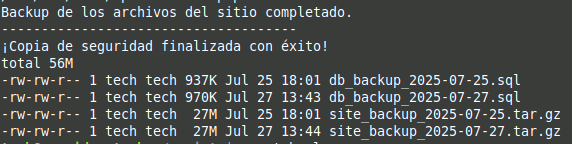
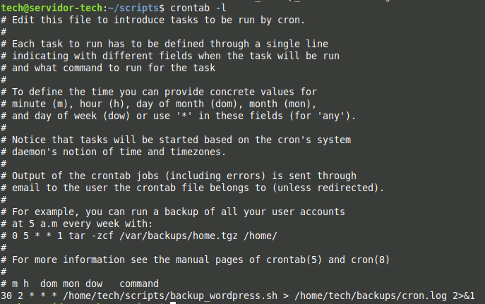

# Automatización de Backups con Bash y Cron

## 1. Descripción del Proyecto

Este proyecto se enfoca en la automatización, una habilidad esencial para la administración de sistemas. El objetivo fue crear una solución robusta y desatendida para realizar copias de seguridad diarias de un sitio WordPress desplegado en un servidor Ubuntu.

Para ello, se desarrolló un script en Bash que empaqueta tanto los archivos del sitio como la base de datos MySQL, y se utilizó el planificador de tareas Cron para ejecutar este script automáticamente todos los días.

**Tecnologías y Herramientas:**
*   **Lenguaje de Scripting:** Bash
*   **Herramientas de Línea de Comandos:** `mysqldump`, `tar`, `mkdir`, `date`
*   **Planificador de Tareas:** Cron
*   **Aplicación de Destino:** WordPress (Stack LAMP)

---

## 2. El Script de Backup

El corazón de este proyecto es el script `backup_wordpress.sh`. Este script realiza las siguientes acciones:
1.  Define variables de configuración para la base de datos y los directorios.
2.  Crea un directorio de backups si no existe.
3.  Utiliza `mysqldump` para exportar la base de datos de WordPress a un archivo `.sql` con fecha.
4.  Utiliza `tar` para comprimir todo el directorio de archivos del sitio (`/var/www/html`) en un archivo `.tar.gz` con fecha.
5.  Imprime un mensaje de éxito y lista los archivos creados.

Puedes ver el código completo del script aquí: **[backup_wordpress.sh](./backup_wordpress.sh)**

**Resultado de la ejecución manual del script:**


---

## 3. Automatización con Cron

Para que el proceso fuera completamente automático, se añadió una nueva tarea al planificador Cron del sistema. Se utilizó el comando `crontab -e` para editar las tareas del usuario.

La siguiente línea fue añadida para ejecutar el script todos los días a las 2:30 AM:

```bash
30 2 * * * /home/tech/scripts/backup_wordpress.sh > /home/tech/backups/cron.log 2>&1
```

*    ```30 2 * * *:``` Especifica la hora y frecuencia de ejecución.
*    ```/home/tech/scripts/backup_wordpress.sh:``` La ruta absoluta al script.
*    ```> /home/tech/backups/cron.log 2>&1:``` Redirige toda la salida (tanto estándar como de errores) a un archivo de registro para poder verificar la ejecución posteriormente.

**Tarea programada visible con crontab -l:**


--- 

## 4. Conclusiones

Este proyecto demuestra la capacidad de crear soluciones de automatización simples pero potentes utilizando herramientas estándar de Linux. La automatización de backups es una tarea crítica que garantiza la resiliencia y la capacidad de recuperación de cualquier servicio, liberando al administrador de realizar tareas manuales y repetitivas.

